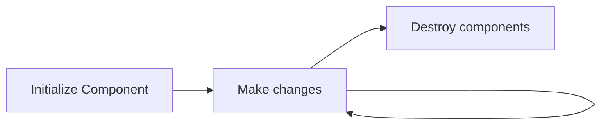

## Life Cycle

A component has several methods to control their main states, there are many, but the ones you may use the most are:
<div class="flex justify-center">

</div>

### Life Cycle Methods

The methods that can be found implementing their corresponding interface are:
#### `ngOnInit`, interface `OnInit`
```ts
ngOnInit(){
  // Initialize your component
}
```

#### `ngOnDestroy`, interface `OnDestroy`

```ts
ngOnDestroy(){
  // Destroy your component
  // Unsuscribe from open observables
}
```

