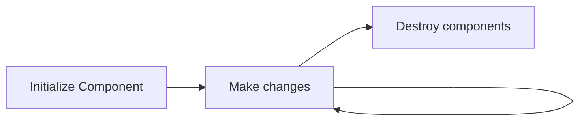

---
# try also 'default' to start simple
theme: apple-basic

title: Learn Angular
# apply any unocss classes to the current slide
class: text-center
highlighter: shiki
drawings:
  persist: false
transition: slide-left
mdc: true
hideInToc: true
---

# Welcome to Angular Training

<div class="flex flex-col flex-wrap justify-center content-center items-center">
  <p>Presentation slides for developers</p>
  
</div>
<div class="pt-12">
  <span @click="$slidev.nav.next" class="px-2 py-1 rounded cursor-pointer" hover="bg-white bg-opacity-10">
    Press Space for next page <carbon:arrow-right class="inline"/>
  </span>
</div>

<div class="abs-br m-6 flex gap-2">
  <p class="text-xs">Learning Angular with Vue based slides, why not?</p>
  <button @click="$slidev.nav.openInEditor()" title="Open in Editor" class="text-xl slidev-icon-btn opacity-50 !border-none !hover:text-white">
    <carbon:edit />
  </button>
  <a href="https://github.com/slidevjs/slidev" target="_blank" alt="GitHub" title="Open in GitHub"
    class="text-xl slidev-icon-btn opacity-50 !border-none !hover:text-white">
    <carbon-logo-github />
  </a>
</div>

<!--
The last comment block of each slide will be treated as slide notes. It will be visible and editable in Presenter Mode along with the slide. [Read more in the docs](https://sli.dev/guide/syntax.html#notes)
-->

---
transition: slide-up
hideInToc: true
level: 2
---

# Navigation

Hover on the bottom-left corner to see the navigation's controls panel, [learn more](https://sli.dev/guide/navigation.html).

## Keyboard Shortcuts

|     |     |
| --- | --- |
| <kbd>right</kbd> / <kbd>space</kbd>| next animation or slide |
| <kbd>left</kbd>  / <kbd>shift</kbd><kbd>space</kbd> | previous animation or slide |
| <kbd>up</kbd> | previous slide |
| <kbd>down</kbd> | next slide |

<!-- https://sli.dev/guide/animations.html#click-animations -->

<p v-after class="absolute bottom-23 left-45 opacity-30 transform -rotate-10">Here!</p>


---
transition: fade-out
hideInToc: true
---

# Table of contents

<Toc minDepth="1" maxDepth="3" columns="2"></Toc>

---

# What is Angular?

Angular is a web framework mantained by Google for SPA (Sigle Page Application).
- **Component-Based Architecture**.
- **TypeScript** by default.
- **Easy Two-Way Data Binding**.
- **Dependency Injection system integrated**.

You may found similarities with [NestJS](https://nestjs.com/) if you come from a *backend* environment.

<footer class="absolute left-30px bottom-30px">
  Read more about <a href="https://angular.dev/overview">Angular</a>
</footer>

<style>
h1 {
  background-color: #2B90B6;
  background-image: linear-gradient(45deg, #fe32d0 10%, #ff0000 20%);
  background-size: 100%;
  -webkit-background-clip: text;
  -moz-background-clip: text;
  -webkit-text-fill-color: transparent;
  -moz-text-fill-color: transparent;
}
</style>

<!--
Here is another comment.
-->

---
layout: two-cols
layoutClass: gap-16
---

# Main concepts

+ `Components`
+ `Modules`
+ `Directives`
+ `Guards`
+ `Pipes`


<footer class="absolute left-30px bottom-30px">
  Examples extracted from <a href="https://angular.dev">Angular Dev</a>.
</footer>


---
---

## Components

```ts {4,9|5|6|7|8} 
import { Component } from "@angular/core";

// todo-list-item.component.ts
@Component({
  standalone: true,
  selector: 'todo-list-item',
  templateUrl: './todo-list-item.component.html',
  styleUrl: './todo-list-item.component.css',
})
export class TodoListItem {
  /* Component behavior is defined in here */
}
```

<ul>
<li v-click="1"> The <code>standalone</code> components do <strong>not need</strong> a module to be created.</li>
<li v-click="2"> The <code>selector</code> is the name other components will use to create the component, as a XHTML tag.</li> 
<li v-click="3"> The <code>template URL</code> has the "HTML" for the component. This is not HTML as it can be enriched with Angular sintaxis.</li> 
<li v-click="4"> The <code>style</code> URL has the <kbd>css</kbd>, <kbd>sass</kbd> or <kbd>scss</kbd> styles for the components. These styles are encapsulated for the component. If you want to  have the global styles, you will have to store them in a <code>global.css</code> file.</li>

</ul>

---
---

### Properties

To share data between between components parent and children there are two main properties:

#### `Input`

```ts
@Input() clicks: int;
```
Input decorator marks a property as a value that can be added to that component.

<hr class="mt-2 mb-2"/>


#### `Output`

```ts
@Output() name: EventEmitter<string>;
```
Output decorator marks a property as a value that can be emitted to the parent component.

---

### Life Cycle

A component has several methods to control their main states, there are many, but the ones you may use the most are:
<div class="flex justify-center">

</div>

### Life Cycle Methods

The methods that can be found implementing their corresponding interface are:
#### `ngOnInit`, interface `OnInit`
```ts
ngOnInit(){
  // Initialize your component
}
```

#### `ngOnChanges`, interface `OnChanges`
```ts
ngOnChanges(){
  // Change your component
}
```

---

#### Javascript `setters`
It's better for code manteinance to use setters instead of multiple `ngOnChanges` conditions. Like this:

```ts
 @Input()
 set example(msg) {
    if (msg === 0)
      this.example = 1;
    else
      this.example = msg;
  }
```

, with this you can specify input control in a better way.

#### `ngOnDestroy`, interface `OnDestroy`
```ts
ngOnDestroy(){
  // Destroy your component
  // Unsuscribe from open observables
}
```

---

## Directives
### ngIf
Sets a condition for the node to be rendered:
```html
  <p *ngIf="age>=18">You are an adult.</p>
```

### ngFor
Renders as many elements as the array contians:

```html
<ul *ngFor="let name of names">
  <li>{{ name }}</li>
</ul>
```


---

### ngClass
Adds the `css` class conditionally:
```html
<div [ngClass]="{'pt-2': true, 'container': true, 'green': false}">
  <!-- More content-->
</div>
```
This can be useful when using class properties to activate or deactivate classes programatically.

### ngStyle
Same, but with `css` styles.

---

## Pipes
Angular uses `pipes` to transform data before displaying it to the HTML.
```html
<span>{{ variable | pipe }}</span>
```

, where `pipe` can be:

- `date`
- `uppercase`
- `lowercase`
- `currency`
- `async`, to consume an observable
- . . .

For example:
```html
<span>{{ name | uppercase }}</span>
```

---

## Formularies
WIP

### Static
### Reactives


---

## Guards
WIP

---

## Templates

WIP

### ng-template

### ng-container


---

# RXJS and Observables

WIP

---

# HTTP Requests
HTTP Requests are the most common way to gather and send information. In Javascript, `fetch` and `XMLHttpRequest` APIs can be used for HTTP requests. Nevertheless, as Angular is oriented to observables more than asynchronous code, `HttpClient` is provided as a class to send requests.


```ts
export declare class HttpClient {
    private handler;
    // . . .
    request(method: string, url: string, options: {
        body?: any;
        headers?: HttpHeaders | {
            [header: string]: string | string[];
        };
        context?: HttpContext;
        observe?: 'body';
        params?: HttpParams;
        reportProgress?: boolean;
        responseType: 'arraybuffer';
        withCredentials?: boolean;
        // ...
    }): Observable<ArrayBuffer>;
    // request, get, post, put, patch, delete...
}
```
---

Inside a component we may found the following structure. A client provided as dependency injection and a method to send and process requests:
```ts
    constructor(private http:HttpClient) {}
    
    sendRequest(){
      this.http.get<Type[]>(url)
            .map(data => /* Do something*/);
    }
```
---
layout: center
class: text-center
---

# Learn More

[Documentation](https://angular.dev/)
